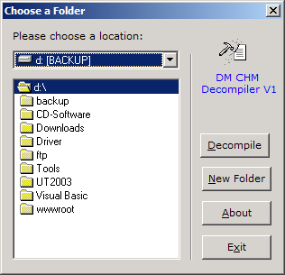



## DM CHM Decompiler

### Description

Hi this is a small add-on I made for windows to allow you to decompile CHM HTML Help files anyway Please vote for this code if you like it

PS please see the readme html file so instructions on how to us this code. I have also included a small help file that tells you more about this project.
 
### More Info
 

             |
---                |---
**Submitted On**   |2001-07-31 13:26:42
**By**             |[dreamvb](https://github.com/Planet-Source-Code/PSCIndex/blob/master/ByAuthor/dreamvb.md)
**Level**          |Beginner
**User Rating**    |5.0 (25 globes from 5 users)
**Compatibility**  |VB 3\.0, VB 4\.0 \(16\-bit\), VB 4\.0 \(32\-bit\), VB 5\.0, VB 6\.0
**Category**       |[Miscellaneous](https://github.com/Planet-Source-Code/PSCIndex/blob/master/ByCategory/miscellaneous__1-1.md)
**World**          |[Visual Basic](https://github.com/Planet-Source-Code/PSCIndex/blob/master/ByWorld/visual-basic.md)
**Archive File**   |[DM\_CHM\_Dec1493911182002\.zip](https://github.com/Planet-Source-Code/dreamvb-dm-chm-decompiler__1-40526/archive/master.zip)

